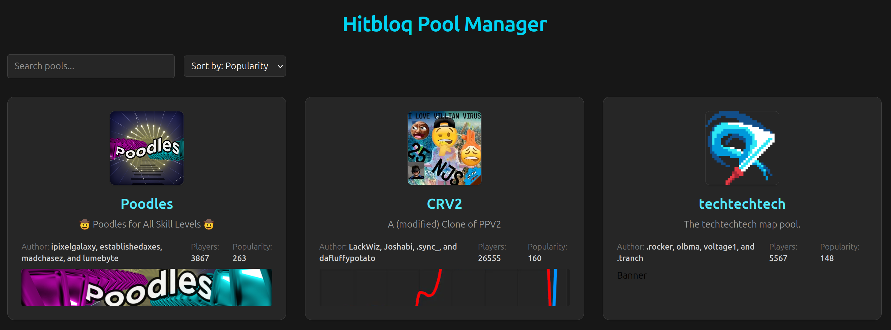

# EPIC Hitploq admin tool

A web tool to managing Hitbloq pools.



## Project Overview
This project is a Spring Boot backend application with an integrated React/Vite frontend.  
The backend exposes REST endpoints for proxying Hitbloq-related API calls and also includes a PostgreSQL database.

The React frontend is built with Vite and can be served directly by Spring Boot from the `src/main/resources/static` directory. During development, the frontend can also run separately via the Vite dev server while forwarding API requests to the Spring Boot backend.


## Backend (mandetory: do this first)
Run backend:
```bash
cd backend/

# Release
mvn spring-boot:run
# Dev
mvn spring-boot:run "-Dspring-boot.run.profiles=dev"
```
This auto build the frontend and launches the postgres docker container. The application is reachable via [localhost:3001](localhost:3001).


## Frontend dev (optional live reload dev server)
This is not needed as it only enables live reload for development. Run dev frontend:
```bash
cd frontend/
npm run dev
```
The live reoload frontend is reachable via [localhost:5173](localhost:5173)

